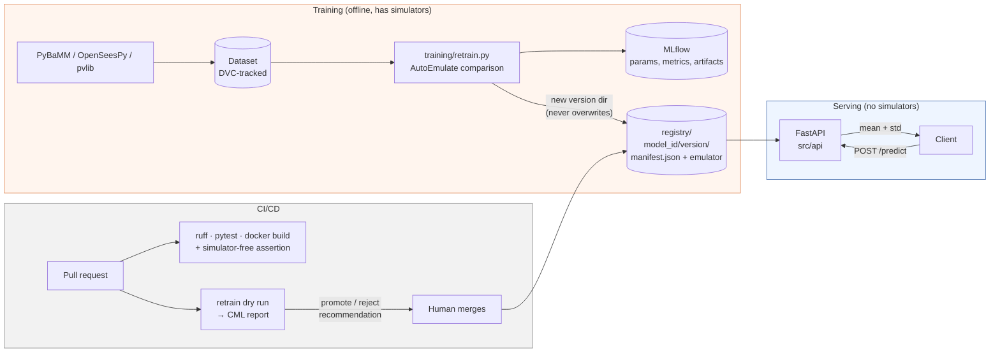

# emulator-service

A production-grade serving and retraining platform for scientific emulators.

Three sibling projects — [`battery-emulator`](https://github.com/AIabdAI/battery-emulator),
[`frame-emulator`](https://github.com/AIabdAI/frame-emulator) and [`pv-emulator`](https://github.com/AIabdAI/pv-emulator) — each train
AutoEmulate surrogates of an expensive physics simulator. This service wraps them in one
versioned registry behind a validated REST API that returns predictions **with
uncertainty**, plus containerisation, experiment tracking, and CI that proposes
retraining but never promotes a model on its own.

---

## Architecture



The dividing line that matters: **everything left of the registry knows about
simulators; nothing right of it does.** The service loads emulators through AutoEmulate
alone, so `pybamm`, `openseespy` and `pvlib` never enter the serving image.

---

## Quickstart

```bash
# 1. Populate the registry from the sibling projects (or with stand-ins)
python scripts/build_registry.py --projects ../battery-emulator ../pv-emulator ../frame-emulator
python scripts/build_registry.py --synthetic      # no siblings available

# 2. Bring up the API and an MLflow tracking server
docker compose up --build

# API   -> http://localhost:8000        (docs at /docs)
# MLflow -> http://localhost:5000
```

### API examples

```bash
# Liveness and how many model versions loaded
curl -s http://localhost:8000/health
# {"status":"ok","n_models_loaded":11,"registry_path":"/app/registry","autoemulate_version":"1.2.1"}

# List models with their held-out metrics
curl -s http://localhost:8000/models

# Full manifest, including input units and training-domain bounds
curl -s http://localhost:8000/models/synthetic-smooth

# Predict a batch. The response carries a standard deviation per row.
curl -s -X POST http://localhost:8000/models/synthetic-smooth/predict \
  -H 'Content-Type: application/json' \
  -d '{"inputs":[{"x1":0.5,"x2":0.5,"x3":0.5},{"x1":0.1,"x2":0.9,"x3":0.3}]}'
```

```json
{
  "model_id": "synthetic-smooth",
  "version": "1.0.0",
  "output_name": "y_smooth",
  "output_unit": "-",
  "n_rows": 2,
  "predictions": [
    {"mean": 1.0662553310394287, "std": 0.0010000000555810387},
    {"mean": 0.6635318994522095, "std": 0.002524465354686799}
  ]
}
```

(The stand-in model emulates `sin(2·x1) + 0.5·x2² + 0.2·x3`, whose exact values at those
two points are 1.0665 and 0.6637 — so the emulator is right to about 2e-4, and its
reported `std` is the right order of magnitude for that error.)

**An out-of-domain input is refused, by name:**

```bash
curl -s -X POST http://localhost:8000/models/synthetic-smooth/predict \
  -H 'Content-Type: application/json' \
  -d '{"inputs":[{"x1":5.0,"x2":0.5,"x3":0.5}]}'
```

```json
{
  "error": "input_out_of_bounds",
  "parameter": "x1",
  "row": 0,
  "value": 5.0,
  "valid_range": [0.0, 1.0],
  "message": "row 0: parameter 'x1' = 5.0 is outside its valid range [0.0, 1.0]. The emulator was never trained there and would extrapolate."
}
```

A specific version can be addressed with `?version=1.0.0`; without it the highest
semantic version is served.

### Serving real emulators end-to-end

All three sibling projects registered — 11 model versions from three different
simulators, served behind one contract:

```
model_id                   output                       R²        project
battery-capacity           capacity_Ah                  0.9749    battery-emulator
battery-energy             energy_Wh                    0.9771    battery-emulator
battery-temperature-rise   max_temp_rise_K              0.7634    battery-emulator
frame-base-shear           peak_base_shear_kN           0.9999    frame-emulator
frame-drift-at-peak        drift_at_peak_pct            0.9734    frame-emulator
frame-initial-stiffness    initial_stiffness_kN_per_m   1.0000    frame-emulator
pv-specific-yield          specific_yield_kWh_per_kWp   0.9998    pv-emulator
pv-capacity-factor         capacity_factor_pct          0.9998    pv-emulator
pv-clipping-loss           clipping_loss_pct            0.9993    pv-emulator
synthetic-linear           y_linear                     1.0000    synthetic-standin
synthetic-smooth           y_smooth                     1.0000    synthetic-standin
```

`frame-drift-at-peak` is an **MLP** — a deterministic emulator — and correctly reports
`std = 0.0` rather than inventing an interval. Getting that right required a real fix:
`torch.Tensor` has a `.mean` attribute (a bound method), so the duck-typed
`hasattr(out, "mean")` check misclassified it as a distribution and the startup probe
rejected the model. The check is now `isinstance(out, Distribution)`, and two tests
cover it.

Two cross-checks against the true simulators, both passing:

| Model | Service prediction | True simulator | Error |
|---|---|---|---|
| `battery-capacity` at Chen2020 baseline (1 C, 25 °C) | 5.0101 ± 0.1987 A·h | 4.9478 A·h | **1.3 %** |
| `frame-initial-stiffness` at f'c = 18 MPa, midpoint geometry | 4238.0 ± 9.2 kN/m | 4218.9 kN/m | **0.45 %** |

Note that the manifest bounds are the **actual sampled training domain**, not the
nominal config ranges — e.g. `c_rate` is `[0.5034, 2.9999]` rather than `[0.5, 3.0]`,
because that is where the Latin Hypercube design really put samples.

That is the whole contract working: a millisecond answer, an honest error bar, and the
error bar is the right size.

Pushing `c_rate` to 9.0 — outside the training domain — returns `422 input_out_of_bounds`
with `valid_range: [0.5034, 2.9999]`, and the emulator is never called.

---

## Endpoints

| Method | Path | Purpose |
|---|---|---|
| `GET` | `/health` | Liveness + count of loaded model versions |
| `GET` | `/models` | All models with metadata and available versions |
| `GET` | `/models/{model_id}` | Full manifest (`?version=` optional) |
| `POST` | `/models/{model_id}/predict` | Batch prediction with per-row mean and std |

Every response carries an `X-Response-Time-ms` header, and every request emits one
structured JSON log line with model id, batch size, latency and status.

---

## Measured performance

Batch of 100 rows, in-process (excludes network and container overhead), 100 timed
requests after 10 warm-up requests, on a CPU-only Windows laptop:

| | `battery-capacity` (real, 480 training points) | `synthetic-linear` (160 training points) |
|---|---|---|
| p50 | **27.60 ms** | 11.85 ms |
| p95 | **37.93 ms** | 13.66 ms |
| p99 | 48.44 ms | 14.38 ms |
| throughput | ~3,530 rows/s | ~8,370 rows/s |

**Read the left column.** The real emulator is ~2.3× slower than the synthetic stand-in
for the obvious reason: a Gaussian Process prediction costs O(n) per row against its
training set, and the real model has three times the training data. Quoting only the
stand-in's number would have flattered the service by a factor of two.

Reproduce with
`python scripts/loadtest.py --model battery-capacity --batch 100 --requests 100`, or
against a running container with `--url http://localhost:8000`. These are honest
single-process numbers on modest hardware; they are not a claim about a tuned production
deployment.

**Registry size:** 11 serialised emulators total ~36 MB (largest single file 7 MB),
committed so the quickstart works on a clean clone. That is comfortably inside GitHub's
limits, but it is also the point at which moving the binaries to DVC — keeping only the
manifests in git — becomes the better answer if more projects are added.

**Serving image size:** reported by CI on every build
(`docker images emulator-service:ci --format "{{.Size}}"`). The image installs
CPU-only torch from PyTorch's CPU index rather than the default wheel, which alone
avoids roughly 2 GB of CUDA libraries the service cannot use.

> Docker was not available in the environment this repository was developed in, so the
> image size is reported by CI rather than quoted here from a local build. The
> `docker-build` job in `.github/workflows/ci.yaml` builds the image, prints its size,
> asserts the image is simulator-free, and smoke-tests `/health` in the container.

---

## Retraining

```bash
# Dry run: trains, logs to MLflow, prints a promote/reject recommendation
python training/retrain.py --dataset-config training/dataset_configs/synthetic_smooth.yaml

# Write a new version, but only if held-out R2 improves
python training/retrain.py --dataset-config ... --promote
```

`retrain.py` accepts **any** conforming dataset: a CSV or parquet file plus a small YAML
config naming the input columns, the output column, and the units. Nothing in it is
specific to a simulator.

Two rules it will not break:

1. **Versions are immutable.** Writing to an existing version directory raises
   `FileExistsError`. Retraining always produces a new version.
2. **CI never promotes.** The workflow runs the dry form and posts a CML report with a
   promote/reject recommendation. Promotion happens when a human merges.

---

## Design decisions

**Why a file-based registry instead of a database.** The registry is a directory of
manifests, so a model version is a reviewable diff: promoting a model is a pull request,
and its provenance — dataset hash, metrics, training date, autoemulate version — is
visible in the same review. It stands up with no infrastructure, and the loader is the
only thing that would change to move it behind S3 or a model registry service.

**Why uncertainty is in the response contract, not an option.** A surrogate replaces a
simulator whose answer someone would otherwise have trusted. Returning a bare mean
invites a caller to treat an interpolated guess and a well-constrained prediction
identically. Making `std` non-optional forces the question "how sure is it here?" to be
answerable at every call site. Deterministic emulators report `std = 0.0` rather than a
fabricated interval — the honest answer for a model that has no notion of uncertainty.

**Why bounds live in the manifest and are enforced at the boundary.** An emulator
queried outside its training domain does not error; it extrapolates and returns a
confident-looking number that is simply wrong. That failure is silent and it is the one
most likely to reach a decision. Encoding the *actual* sampled domain (the min/max of
each input column in the training dataset, not the nominal config range) into the
manifest and rejecting violations with 422 makes it unreachable rather than merely
documented. `tests/test_api.py::test_out_of_bounds_input_never_reaches_the_emulator`
patches `predict` to raise if it is ever called, so a regression fails loudly.

**Why no simulators in the serving image.** PyBaMM, OpenSeesPy and pvlib are only needed
to *create* training data. Shipping them would add hundreds of megabytes and a solver
stack's worth of attack surface to a process whose entire job is a matrix multiply and a
covariance lookup. The separation is asserted in CI, both inside the image and in the
serving process.

**Why the API is version-aware from the start.** Retraining is routine, and the moment
two versions of a model coexist, "which model produced this number?" becomes an audit
question. Every prediction response echoes the `model_id` and `version` that produced it.

---

## Repository layout

```
emulator-service/
├── docs/model_manifest_schema.md   # the training <-> serving contract
├── registry/<model_id>/<version>/  # manifest.json + serialised emulator
├── src/api/                        # main.py, schemas.py, registry_loader.py, logging_conf.py
├── training/                       # retrain.py + dataset configs
├── scripts/                        # build_registry.py, loadtest.py
├── tests/                          # 27 tests: API, bounds, manifests, registry
├── .github/workflows/              # ci.yaml, retrain.yaml
├── Dockerfile                      # multi-stage, non-root, healthcheck
├── requirements-serving.txt        # serving deps only
└── docker-compose.yaml             # API + MLflow
```

---

## Local development

```bash
python -m venv .venv && .venv/Scripts/activate    # Windows
pip install -e ".[dev,training]"
pip install --index-url https://download.pytorch.org/whl/cpu torch==2.13.0

python scripts/build_registry.py --synthetic
ruff check src/ tests/ training/ scripts/
pytest tests/ -q
uvicorn src.api.main:app --reload
```

### Data versioning (DVC)

Datasets are DVC-tracked rather than committed. The remote is configured **locally, not
in the repository**:

```bash
dvc remote add -d storage gdrive://<folder-id>     # or s3://, azure://, a local path
dvc remote modify --local storage <credential-key> <value>   # -> .dvc/config.local
```

`.dvc/config.local` is gitignored, and CI reads the remote URL from the
`DVC_REMOTE_URL` repository secret. **No credentials belong in this repository.** If no
remote is configured, the retrain workflow regenerates the synthetic dataset so the
pipeline stays demonstrable.

---

## Known limitations

- The registry is loaded into memory at startup, so publishing a new version requires a
  restart (or a container recreate). A watch-and-reload path is deliberate future work
  rather than something claimed here.
- The load-test numbers are single-process and in-process. Real deployment throughput
  depends on worker count, which this repository does not tune.
- `retrain.py` compares a single held-out R2 against the registered value. That is a
  reasonable gate, not a full model-quality review — which is exactly why promotion
  needs a human.
- Docker build and the CML PR comment are exercised by the CI workflow definitions; they
  were not run locally in this environment (no Docker daemon, no GitHub remote).
