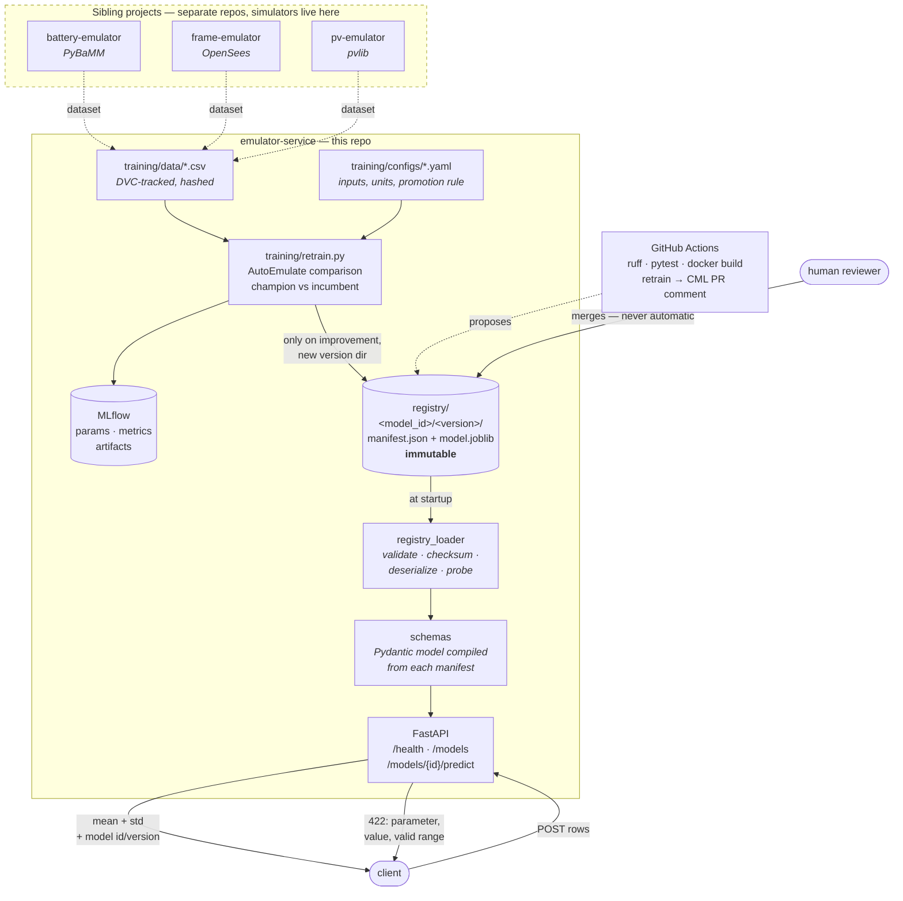

# emulator-service

**A production serving and retraining platform for scientific emulators.**

Three sibling projects — `battery-emulator` (PyBaMM), `frame-emulator` (OpenSees),
`pv-emulator` (pvlib) — each spend hours of CPU turning a physics simulator into a fast
[AutoEmulate](https://github.com/alan-turing-institute/autoemulate) surrogate. This
project is what turns those artifacts into something an engineering team can actually
call: a versioned registry, a validated REST API that returns **predictions with
uncertainty**, containerisation, experiment tracking, and CI that proposes retrained
models for a human to approve.

The central design commitment is this: **an out-of-domain input can never reach an
emulator.** A surrogate queried outside the region it was fitted on does not fail — it
returns a confident, plausible, wrong number. So the training domain travels with the
model in its manifest, the API compiles its request validation from that manifest, and
anything outside it is rejected with `422` before a tensor is ever built.

---

## Architecture



The dashed boundary is load-bearing. **No simulator library is installed anywhere in
this repo**, and least of all in the serving image. `pybamm`, `openseespy` and `pvlib`
are needed to *produce* training data; a serialized emulator needs none of them to
answer a question.

---

## Quickstart

```bash
git clone <this repo> && cd emulator-service
docker compose up --build
```

Two services come up:

| | URL | What it is |
|---|---|---|
| API | <http://localhost:8000/docs> | Interactive OpenAPI docs |
| MLflow | <http://localhost:5000> | Tracking server, SQLite-backed, local volume |

Nothing else is required — no cloud account, no GPU, no simulator install. The registry
artifacts are committed, so the service has models to serve on first boot.

### Check it is alive

```bash
curl -s http://localhost:8000/health
```

```json
{
  "status": "ok",
  "models_loaded": 2,
  "model_ids": ["battery-capacity-fade", "frame-peak-drift"],
  "autoemulate_version": "1.2.1",
  "registry_path": "/app/registry",
  "failures": []
}
```

### List what is registered

```bash
curl -s http://localhost:8000/models | jq '.models[] | {model_id, version, output, r2, stand_in}'
```

```json
{
  "model_id": "battery-capacity-fade",
  "version": "1.0.0",
  "output": "capacity_fade",
  "r2": 0.9998221397399902,
  "stand_in": true
}
{
  "model_id": "frame-peak-drift",
  "version": "1.0.0",
  "output": "peak_drift_ratio",
  "r2": 0.9998951554298401,
  "stand_in": true
}
```

### Inspect a model's contract

`GET /models/{id}` returns the full manifest — input names, **units**, training-domain
bounds, held-out metrics, dataset hash — plus a ready-to-paste example request.

```bash
curl -s http://localhost:8000/models/battery-capacity-fade \
  | jq '{version, emulator_class, inputs: .manifest.inputs, example_request}'
```

### Predict, with uncertainty

```bash
curl -s -X POST http://localhost:8000/models/battery-capacity-fade/predict \
  -H 'Content-Type: application/json' \
  -d '{"rows":[
        {"c_rate":1.5,"temperature":25.0,"depth_of_discharge":0.8},
        {"c_rate":2.5,"temperature":40.0,"depth_of_discharge":0.9}
      ]}'
```

```json
{
  "model_id": "battery-capacity-fade",
  "version": "1.0.0",
  "output": "capacity_fade",
  "output_unit": "percent",
  "n_rows": 2,
  "supports_uq": true,
  "predictions": [
    { "mean": 10.808354377746582, "std": 0.030380746349692345 },
    { "mean": 17.754638671875,    "std": 0.035539254546165466 }
  ]
}
```

Response headers carry `X-Prediction-Latency-Ms` (server-side inference time) and
`X-Request-ID` (echoed if you supply one, generated otherwise, and present on every log
line for that request).

### Try to leave the training domain

```bash
curl -s -X POST http://localhost:8000/models/battery-capacity-fade/predict \
  -H 'Content-Type: application/json' \
  -d '{"rows":[{"c_rate":7.5,"temperature":25.0,"depth_of_discharge":0.8}]}'
```

```
HTTP/1.1 422 Unprocessable Entity
```

```json
{
  "error": "input_out_of_contract",
  "detail": "row 0: c_rate = 7.5 is outside the training domain of battery-capacity-fade v1.0.0: valid range is [0.20616632, 2.9997138] 1/h. The emulator was not fitted there and would be silently wrong.",
  "model_id": "battery-capacity-fade",
  "version": "1.0.0",
  "violations": [
    {
      "row": 0,
      "parameter": "c_rate",
      "value": 7.5,
      "reason": "c_rate = 7.5 is outside the training domain of battery-capacity-fade v1.0.0: valid range is [0.20616632, 2.9997138] 1/h. The emulator was not fitted there and would be silently wrong.",
      "min": 0.20616632,
      "max": 2.9997138,
      "unit": "1/h"
    }
  ]
}
```

The message names the parameter, the offending value, the valid range **and its unit**.
A missing input, an unknown input (a typo), a non-numeric value, `NaN` and `Infinity`
are all rejected the same way. One bad row rejects the whole batch — a partially served
batch would leave the caller unsure which predictions to trust.

Proven by tests, not by assertion: `tests/test_api.py::test_out_of_bounds_is_rejected_with_parameter_and_range`
and eleven neighbours.

---

## ⚠️ The registered models are stand-ins

The sibling projects' artifacts are not available in this environment. Rather than
develop the service against mocks, the two registered models are **real AutoEmulate
emulators, trained by the real pipeline in this repo**, on synthetic data generated from
closed-form response surfaces with plausible units and ranges.

They are not physics. Every one carries `"stand_in": true` in its manifest, `/models`
reports it, and the retrain report prints a warning. Point `training/configs/*.yaml` at
a real simulator dataset and nothing else in the service changes.

| Model | Project | Inputs | Output | Emulator | Held-out R² |
|---|---|---|---|---|---|
| `battery-capacity-fade` | battery-emulator | c_rate, temperature, depth_of_discharge | capacity_fade [%] | GaussianProcessMatern32 | 0.9998 |
| `frame-peak-drift` | frame-emulator | pga, yield_strength, storey_mass, damping_ratio | peak_drift_ratio [%] | GaussianProcessRBF | 0.9999 |

R² this high is a property of a smooth analytic response surface with small additive
noise, not evidence that the platform makes hard problems easy.

---

## Performance

Measured with `scripts/loadtest.py` against the `docker compose` stack — full HTTP round
trip from a client on the host, not a bare tensor benchmark.

**Machine:** Intel Core i7-12650H (10 cores / 16 threads), 15.7 GB RAM, Windows 11 +
Docker Desktop (WSL2). Single uvicorn worker, `OMP_NUM_THREADS=1`, CPU only.
300 requests per batch size after 20 warm-up requests.

| Batch | p50 (ms) | p95 (ms) | p99 (ms) | Inference-only p95 (ms) | Throughput (rows/s) |
|---:|---:|---:|---:|---:|---:|
| 1 | 5.86 | 7.19 | 8.80 | 4.20 | 167 |
| 10 | 6.12 | 6.93 | 7.54 | 3.94 | 1,615 |
| **100** | **8.63** | **11.38** | **14.05** | 6.04 | **11,005** |
| 500 | 25.08 | 29.09 | 38.12 | 17.54 | 18,775 |

**p95 for batch=100 is 11.4 ms end to end, of which ~6 ms is inference.** The rest is
HTTP, JSON, and validation. Run-to-run variance on a laptop is roughly ±10% — a repeat
of the batch=100 row on a freshly rebuilt image gave p50 9.24 / p95 12.22. Reproduce it
yourself:

```bash
python scripts/loadtest.py --url http://localhost:8000 --batch 100 --requests 300
```

Two honest caveats:

- These are **sequential** requests from one client, so the throughput column is
  `rows ÷ wall-clock`, not a concurrency benchmark. With one worker and
  `OMP_NUM_THREADS=1`, concurrent load queues.
- Latency is dominated by the *emulator family*, not by this service. Exact Gaussian
  processes cost O(n·m) per prediction against the training set. A random forest of the
  same accuracy would be considerably faster and would return no uncertainty at all —
  which is precisely the trade this project declines to make silently.

Connection reuse matters for measurement, not just for speed: the load client holds a
keep-alive connection, because a fresh TCP connection per request measures the client's
socket setup (behind Docker Desktop's Windows port proxy, dramatically so) rather than
the service.

### Image size

```
emulator-service:local    1.71 GB
```

| Layer | Size |
|---|---|
| Python venv (`/opt/venv`) | 1.21 GB |
| `python:3.12-slim` base | ~500 MB |
| Registry + application code | 3.5 MB |

Of the venv, **695 MB is PyTorch** and a further ~190 MB is SciPy/NumPy/scikit-learn.
Those are the runtime an AutoEmulate emulator unpickles into; they are not removable
without giving up the ability to load real artifacts.

What *is* excluded is deliberate and enforced: 90 packages, **zero simulator
libraries**. CI fails the build if `pybamm`, `openseespy` or `pvlib` ever appears:

```bash
docker run --rm emulator-service:local pip list --format=freeze | wc -l   # 90
docker run --rm emulator-service:local pip list | grep -iE 'pybamm|openseespy|pvlib'
# (no output)
```

---

## The registry

```
registry/
└── battery-capacity-fade/
    └── 1.0.0/
        ├── manifest.json        # the contract — see docs/model_manifest_schema.md
        ├── model.joblib         # joblib-serialized AutoEmulate Emulator
        └── model_metadata.csv   # AutoEmulate's own Result metadata
```

A `<model_id>/<version>/` directory is **immutable**. Retraining writes a new version;
`training/retrain.py` refuses to overwrite, and so does `write_manifest`.

At startup, for every entry, the loader:

1. parses and schema-validates `manifest.json`;
2. checks `model_id`/`version` against the directory names;
3. checks the artifact exists and matches its declared `sha256`;
4. deserializes it via `AutoEmulate.load_model`;
5. runs a **probe prediction** at the domain midpoint, confirming the artifact really
   accepts `len(inputs)` features, returns a single output, and agrees with the
   manifest's `supports_uq` claim.

Every failure names the path and the field:

```
registry/battery-capacity-fade/1.0.0/manifest.json: inputs.1: Value error, max (5.0) must be greater than min (45.0)
```

`REGISTRY_STRICT=true` (the default, and what compose uses) refuses to start on a bad
entry, so a half-loaded registry cannot pass for a healthy one. `REGISTRY_STRICT=false`
quarantines the failures and reports them on `/health` with `"status": "degraded"`.

Full schema: [`docs/model_manifest_schema.md`](docs/model_manifest_schema.md).

---

## Retraining

```bash
python training/retrain.py --config training/configs/battery_capacity_fade.yaml
```

Takes any conforming dataset (CSV or Parquet) plus a small YAML config. It hashes the
dataset, runs the AutoEmulate comparison, logs everything to MLflow, compares the
champion against the incumbent registry version, and **writes a new version directory
only on improvement**. Either way it emits a markdown report.

Here is a real one, from re-running the battery config against the incumbent with the
tuning budget raised from 4 to 12 iterations — more search, same answer:

```markdown
## 🛑 Retrain report — `battery-capacity-fade`

**Recommendation: REJECT**

> Candidate `r2` = 0.9998 vs incumbent 0.9998 (higher is better, required margin
> 0.001). Improvement not met.

### Metrics (held-out)

| Metric | Incumbent | Candidate | Δ |
|---|---:|---:|---:|
| `r2` ⭐ | 0.9998 | 0.9998 | +0.0000 |
| `rmse` | 0.0502 | 0.0502 | +0.0000 |

### Provenance

| | Incumbent | Candidate |
|---|---|---|
| Version | 1.0.0 | 1.1.0 |
| Emulator | TransformedEmulator | GaussianProcessMatern32 |
| Rows | 400 | 400 |
| Dataset hash | `sha256:d4ab70ca6d94` | `sha256:d4ab70ca6d94` |

MLflow run: `8565960d7f094e529e938e49da80cc36`

The candidate did not beat the incumbent `r2` by the required margin of 0.001. No
registry version was written.
```

That is the guardrail working. A candidate that ties the incumbent is not an
improvement, and `min_improvement` exists so that run-to-run noise cannot ratchet a
model forward. On a genuine improvement the same run writes `registry/<id>/1.1.0/` —
a new directory, never a modified one — and recommends **PROMOTE**.

Useful flags: `--dry-run` (evaluate and report, never write), `--registry <dir>` (write
to a scratch registry — what CI does), `--no-mlflow`, `--report`/`--json`.

Config in brief — the full files are in `training/configs/`:

```yaml
model_id: battery-capacity-fade
project: battery-emulator
stand_in: true
dataset: { path: training/data/battery_capacity_fade.csv, format: csv }
inputs:
  - { name: c_rate, unit: "1/h", description: Charge/discharge rate }
  # min/max omitted → the training domain is the observed data range
output: { name: capacity_fade, unit: percent }
training: { models: [GaussianProcessRBF, GaussianProcessMatern32], n_splits: 4 }
promotion: { metric: r2, min_improvement: 0.001, version_bump: minor }
```

### Datasets and DVC

Datasets are DVC-tracked; git carries the `.dvc` pointers, not the data.

```bash
dvc pull            # fetch datasets from the configured remote
dvc repro           # not used — retrain.py is the pipeline entry point
```

`.dvc/config` is committed and points at a local remote (`.dvc-storage/`).
**No credentials are in this repo.** For a shared remote, put them in
`.dvc/config.local`, which is gitignored:

```bash
dvc remote add -d gdrive gdrive://<folder-id>
dvc remote modify --local gdrive gdrive_service_account_json_file_path creds.json
```

In CI, the same values come from repository secrets (`DVC_REMOTE_URL`), never from a
file in the tree.

The stand-in datasets have a third path: they are generated by a **seeded, byte-
reproducible** script, so CI can regenerate them and still get a dataset hash that
matches the manifest.

```bash
python training/make_standin_datasets.py
```

"Byte-reproducible" is a stronger claim than "same numbers", and it took a bug to get
right. `pandas.to_csv` defaults to the *platform* line terminator, so the same seed
produced CRLF on Windows and LF in CI — identical values, different bytes, different
sha256, and a manifest hash no other machine could reproduce. The retrain workflow
surfaced it on the first PR by reporting an incumbent and a candidate hash that
disagreed. Pinning `lineterminator="
"` fixed it; the Windows output now hashes to
`0b725c57249d…`, the same digest the Linux runner produces.

---

## CI/CD

### `ci.yaml` — every pull request

| Job | What it does |
|---|---|
| `ruff` | `ruff check` and `ruff format --check`. Installs ruff alone — no 5-minute torch install to lint. |
| `pytest` | CPU-only torch, then the full suite against the **real committed artifacts**, plus a strict registry load. |
| `docker build` | Builds the image, **fails if any simulator library is present**, reports the image size, then boots the container and asserts `/health` is ok and a prediction comes back with a non-null `std`. |

### `retrain.yaml` — when data or the training recipe changes

Triggers on changes to `training/configs/**`, `training/data/**` or `training/retrain.py`
(and on `workflow_dispatch`). It works out which models a PR actually affects, retrains
them **into a scratch registry outside the repo**, and posts the report as a CML comment
on the PR — old vs new metrics, provenance, and a promote/reject recommendation.

**Nothing is auto-promoted.** The workflow produces evidence; the `registry/` on `main`
is untouched. Promotion is a human running `retrain.py` locally, committing the new
version directory, and getting the PR reviewed. That is not ceremony:

- deployment becomes a merge, so **rollback is a revert**;
- the reviewer sees the manifest diff — changed bounds, changed dataset hash, changed
  metrics — as a normal code review;
- a metric that improves for the wrong reason (leakage, a shifted dataset, a lucky
  split) gets a human look before it reaches traffic.

---

## Local development

Requires Python 3.11+ (3.12 used here).

```bash
python -m venv .venv && . .venv/Scripts/activate      # Linux/macOS: . .venv/bin/activate

# CPU-only torch first — the CUDA wheel is several GB and nothing here uses a GPU
pip install --index-url https://download.pytorch.org/whl/cpu torch
pip install -r requirements/dev.txt

pytest                                                 # 64 tests
ruff check . && ruff format --check .

PYTHONPATH=src uvicorn api.main:app --reload           # http://localhost:8000/docs
```

Requirements are split so the boundary is enforced by files, not discipline:

| File | Contents |
|---|---|
| `requirements/serving.txt` | autoemulate, fastapi, uvicorn, pydantic. **No simulators.** |
| `requirements/training.txt` | serving + mlflow, dvc, pyarrow, pyyaml |
| `requirements/dev.txt` | training + pytest, ruff, httpx |
| `requirements-lock.txt` | full `pip freeze` of the verified environment |

Two pins carry their reasons inline in `requirements/training.txt`: `pyarrow>=19`
(18.x exhausts Windows static-TLS slots, after which `import torch` dies with
`WinError 1114` in any process that imported pandas first) and `pathspec==0.12.1`
(DVC 3.59 uses a private symbol that pathspec 1.x removed).

### Environment variables

| Variable | Default | Meaning |
|---|---|---|
| `REGISTRY_PATH` | `./registry` | Registry root |
| `REGISTRY_STRICT` | `true` | Refuse to start on an invalid entry |
| `LOG_LEVEL` | `INFO` | Root log level |
| `MLFLOW_TRACKING_URI` | local SQLite | Tracking server; set to `http://localhost:5000` for the compose one |
| `OMP_NUM_THREADS` | `1` | Per-request determinism over per-request throughput |

---

## Design decisions

### Why a file-based registry rather than a database or MLflow's registry

The registry is a directory tree in git. That is a deliberate choice, not an absence of
one.

- **The registry is reviewable.** A model promotion shows up as a diff: changed bounds,
  changed dataset hash, changed metrics. A row in a database is not something a
  reviewer reads, and neither is a stage transition in a tracking server's UI.
- **Deployment and rollback are git operations.** Promote by merging, roll back by
  reverting. No second source of truth to reconcile with the code that serves it.
- **The serving path has no runtime dependency on MLflow.** MLflow tracks *experiments*
  — a hundred runs, most of them rejected. The registry holds the small number of
  artifacts that are actually served. Coupling the API's startup to a tracking server's
  availability would trade a real capability for a filing cabinet.
- **It scales further than it looks.** Model directories are a few MB. Git LFS covers
  the next order of magnitude, and an object-store sync after that — `REGISTRY_PATH`
  already points wherever you mount it, which is the "cloud is a config change" test.

The honest limit: this does not give concurrent multi-writer promotion or a queryable
model history across hundreds of models. At that point the *loader* stays and the
*discovery* moves behind an interface. Nothing in the API layer knows the registry is
a filesystem.

### Why uncertainty is in the response contract, not an option

An emulator is an approximation of a simulator, and its error is not uniform across the
input space — it is small where training points are dense and large where they are
sparse. A mean without a standard deviation hides exactly the information that tells a
user whether to trust the number.

So `std` is a first-class field. Where an emulator genuinely cannot produce one, the API
returns `"std": null` and `"supports_uq": false` rather than a fabricated zero, and the
registry loader **verifies that claim against the artifact at startup** — a manifest
that says `supports_uq: true` over a deterministic model fails to load.

This is also why the service is built on `Emulator.predict_mean_and_variance` rather
than `predict()`. `predict()` returns a bare tensor for deterministic emulators and a
`torch.distributions.Distribution` for probabilistic ones; branching on that at request
time would leak the emulator family into the API contract. `predict_mean_and_variance`
is uniform across every family AutoEmulate ships, which is what makes one response shape
correct for all of them.

The practical consequence is visible in `training/configs/*.yaml`: both configs restrict
the candidate pool to Gaussian processes. A LightGBM champion might score better on R²
and would still be a **contract regression**, because it cannot honour the promise the
API makes.

### Why no simulators in the serving image

Loading a serialized emulator requires the emulator's own classes and PyTorch. It does
not require the simulator that generated the training data — the physics is already
baked into the fitted parameters.

Keeping simulators out buys three things:

1. **Size.** PyBaMM alone pulls a solver stack (CasADi, SUNDIALS) that would add
   hundreds of MB to an image already dominated by PyTorch.
2. **Attack surface.** The serving process is the one exposed to the network. Every
   native library it does not contain is one that cannot be exploited through it.
3. **A real boundary.** Simulators are heavy, platform-specific and awkward to install.
   Coupling the API to them would make the serving image un-buildable on any machine
   where one of the three siblings' dependencies happens to be broken.

The split is enforced by `requirements/serving.txt` and by a CI job that fails the build
if a simulator ever appears in the image, so the boundary cannot erode by accident.

### Why the whole batch is rejected when one row is out of domain

Serving 99 of 100 rows and silently dropping one produces a response whose shape no
longer matches the request. The caller must then reconcile indices to find out which
prediction is missing — and the most likely outcome is that they do not, and treat a
99-element array as if it were the answer to a 100-element question. Rejecting the batch
makes the failure impossible to miss, and the error body names every offending row.

### Why bounds come from the data, not from physics

`training/retrain.py` derives each parameter's `min`/`max` from the observed range of
the training set unless the config pins them. A cell may be *physically* operable from
0–60 °C, but if the design of experiments only sampled 5–45 °C, the emulator's
trustworthy region is 5–45 °C. Recording the physical limit would license exactly the
silent extrapolation this service exists to prevent.

---

## Repository layout

```
emulator-service/
├── docs/model_manifest_schema.md   # the model-directory contract
├── registry/                       # versioned model dirs (committed)
│   ├── battery-capacity-fade/1.0.0/
│   └── frame-peak-drift/1.0.0/
├── src/api/
│   ├── main.py                     # FastAPI app, routes, error handlers
│   ├── manifest.py                 # manifest schema (shared with training)
│   ├── registry_loader.py          # discovery, validation, probe, prediction
│   ├── schemas.py                  # request/response + manifest-driven bounds
│   └── logging_conf.py             # structured JSON logging
├── training/
│   ├── retrain.py                  # the retraining pipeline
│   ├── make_standin_datasets.py    # seeded, reproducible stand-in data
│   ├── configs/*.yaml              # dataset configs
│   └── data/*.csv.dvc              # DVC pointers
├── tests/                          # 64 tests against real artifacts
├── scripts/loadtest.py             # p50/p95/p99 latency
├── .github/workflows/              # ci.yaml, retrain.yaml
├── Dockerfile                      # multi-stage, non-root, healthcheck
└── docker-compose.yaml             # API + MLflow
```

## Known limitations

- **Single-output emulators only.** Schema v1 has one `output`; the loader rejects an
  artifact that predicts a wider result rather than letting the mismatch pass silently.
  Multi-output would extend the manifest to an `outputs` array.
- **One uvicorn worker.** Each worker holds its own copy of every emulator in memory.
  Horizontal scaling is replicas behind a load balancer, which is what the read-only
  registry mount is designed for.
- **Registry reload requires a restart.** Deliberate — models are loaded and probed once
  at startup, which is what makes `/health` meaningful.
- **The registered models are stand-ins.** See the section above.
